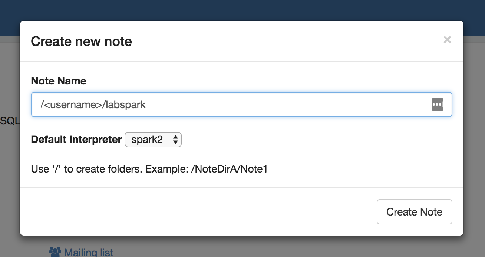

# Universidad EAFIT
# Curso ST0263 Tópicos Especiales en Telemática, 2020-1
# Profesor: Edwin Montoya M. – emontoya@eafit.edu.co
# Profesor: Alvaro Ospina - aeospinas@eafit.edu.co

# LAB SPARK

* Se puede programar en python, scala o java.

* ejemplos en python:

## 1. De forma interactiva via 'pyspark'

// ya trae preconfigurado las variables sc y spark

    $ pyspark
    >>> files = sc.textFile("hdfs:///datasets/gutenberg-small/*.txt")
    >>> wc = files.flatMap(lambda line: line.split(" ")).map(lambda word: (word, 1)).reduceByKey(lambda a, b: a + b)
    >>> wc.saveAsTextFile("hdfs:///tmp/wcout1")

    * asi salva wc un archivo por rdd.
    * si quiere que se consolide en un solo archivo de salida:

    $ pyspark
    >>> files = sc.textFile("hdfs:///datasets/gutenberg-small/*.txt")
    >>> wc = files.flatMap(lambda line: line.split(" ")).map(lambda word: (word, 1)).reduceByKey(lambda a, b: a + b)
    >>> wc.coalesce(1).saveAsTextFile("hdfs:///tmp/wcout2")

## 2. Como un archivo python: [wc-pyspark.py](wc-pyspark.py)

* correrlo:

    $ spark-submit --master yarn --deploy-mode cluster wc-pyspark.py

## 3. Desde Zeppelin Nodebook:

Entre desde un browser a: http://<ip-or-name-amazon-host>:9995 o el servidor que le desigen para el lab


Cree un Notebook:




### Wordcount en python:

```python
    %spark2.pyspark
    files = sc.textFile("hdfs:///datasets/gutenberg-small/*.txt")
    wc = files.flatMap(lambda line: line.split(" ")).map(lambda word: (word, 1)).reduceByKey(lambda a, b: a + b)
    wc.coalesce(1).saveAsTextFile("hdfs:///tmp/wcout1")
```

### wordcount en spark.sql

    %spark2.sql
    SHOW tables

    %spark2.sql
    SHOW database

    %spark2.sql    
    USE <user_vpn>

    %spark2.sql   
    CREATE EXTERNAL TABLE <user_vpn>.docs2 (line STRING) stored as textfile location '/datasets/gutenberg-small/*.txt'

    %spark2.sql
    SELECT word, count(1) AS count FROM (SELECT explode(split(line,' ')) AS word FROM docs2) w GROUP BY word ORDER BY word

## 4. Jupyter Notebooks

### Wordcount [wordcount-spark.ipynb](wordcount-spark.ipynb)

### Dataframes y preparación de datos en pyspark

* notebook: [Data_processing_using_PySpark.ipynb](Data_processing_using_PySpark.ipynb)
* datos ejemplo: [sample_data.csv](../datasets/spark/sample_data.csv)